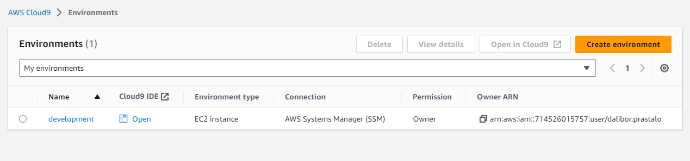
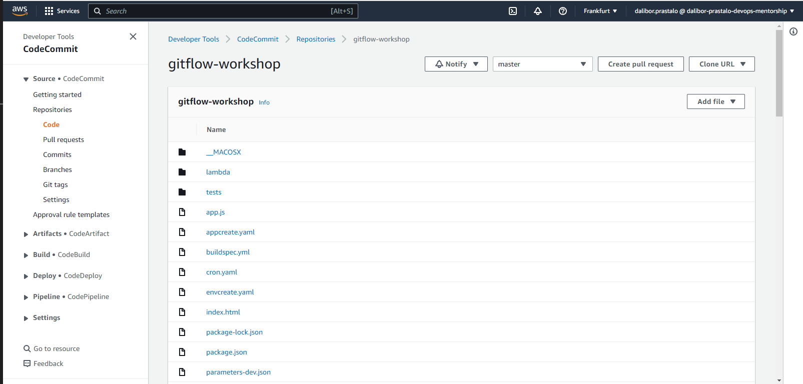
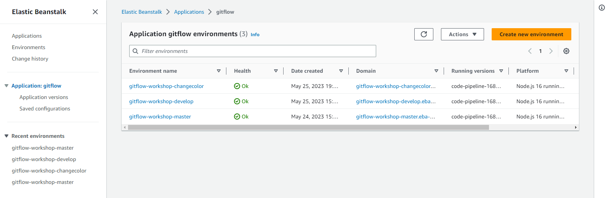
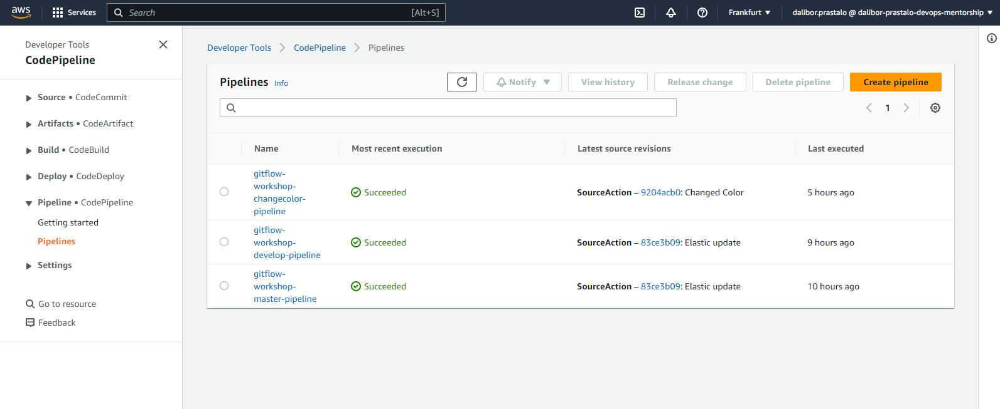
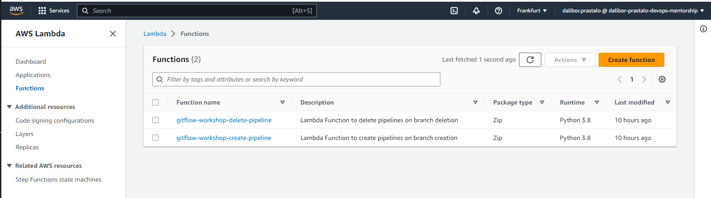
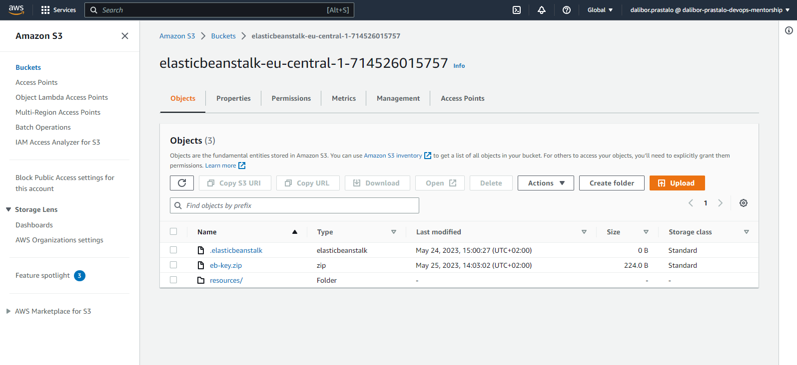

# TASK-11: AWS Tools GitFlow Workshop

Pregledao sam PR drugih kolega prije svega Huseina i Aleksandre gdje su kroz readme.md objasnili detaljan cjelokupan proces izvršavanja ovog taska. 
Trenutno nemam toliko vremena da se posvetim kreiranju detaljnijeg PR jer sam na poslovnom putu i nadam se da neće biti problem da odobrite PR jer sam isti odradio do kraja. U nastavku se nalaze osnovni dijelovi ovog taska kroz screenshots, hvala na razumijevanju !

### AWS Cloud9

### Code Commit 

### Elastic Beanstalk

### Code Pipeline

### AWS Lambda

### S3 

### Change Color Success

